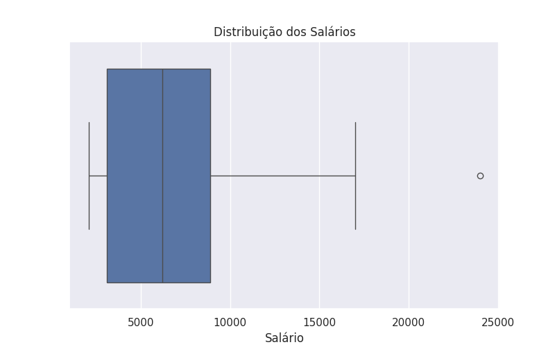
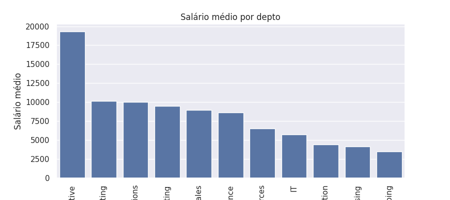

# Projeto Avaliativo - RH Analytics

Projeto de conclusão do Módulo 1 do curso de Visualização de Dados e Business Intelligence [T3] - SENAI SC.

Aluno(a): [preencher nome completo]

## Sobre o Projeto

Este projeto analisa dados de Recursos Humanos do schema `HR`, relacionando funcionários, salários, departamentos, cargos e localização geográfica.

A proposta é partir das consultas SQL, exportar os resultados em CSV e usar Python para transformar esses dados em estatísticas e visualizações. A análise busca responder: como os salários estão distribuídos, quais departamentos concentram mais funcionários, quais cargos têm maiores médias salariais e como a distribuição geográfica influencia a leitura dos resultados.

## Objetivos

- Extrair dados de RH com consultas SQL usando `LEFT JOIN`.
- Gerar arquivos CSV a partir dos resultados das consultas.
- Explorar os dados em Python com `pandas`, `matplotlib` e `seaborn`.
- Calcular média, mediana, mínimo e máximo dos salários.
- Criar visualizações para apoiar a interpretação dos dados.
- Apresentar os principais insights encontrados na análise.

## Estrutura do Repositório

```text
├── data/                 # Arquivos CSV exportados das consultas SQL
├── images/               # Gráficos gerados no notebook
├── notebook/             # Notebook com a análise em Python
├── sql/                  # Consultas SQL usadas na extração
└── README.md
```

## Dados Utilizados

Foram utilizadas tabelas do schema `HR`:

- `EMPLOYEES`
- `DEPARTMENTS`
- `JOBS`
- `LOCATIONS`
- `COUNTRIES`
- `REGIONS`

Essas tabelas permitem conectar informações dos funcionários com seus departamentos, cargos e localização.

## Como Rodar

```
#TODO
```

## Consultas SQL

| Query | Arquivo gerado | Campos retornados | Filtro aplicado |
| --- | --- | --- | --- |
| `sql/query_1.sql` | `data/query_01.csv` | funcionário, nome, sobrenome, salário, departamento e cargo | salários maiores que zero |
| `sql/query_2.sql` | `data/query_02.csv` | funcionário, nome, sobrenome, salário, departamento, endereço, cidade, estado, país e região | registros com região informada |

A primeira consulta apoia a análise salarial por departamento e cargo. A segunda amplia a leitura dos dados ao incluir localização, país e região.

## Análise em Python

A análise foi desenvolvida no arquivo `notebook/projeto_avaliativo.ipynb`.

No notebook, os dados são carregados a partir dos CSVs, tratados para facilitar a leitura e analisados com estatísticas descritivas. Também são criados agrupamentos por departamento, cargo, estado e região, permitindo comparar concentração de funcionários e diferenças salariais entre grupos.

## Resultados e Insights

A base salarial possui 107 funcionários. O salário médio geral é de aproximadamente 6.461,83, enquanto a mediana é 6.200,00. Como a média está acima da mediana, é possível perceber que alguns salários mais altos influenciam o resultado geral.

O maior salário encontrado foi 24.000,00, valor que se destaca em relação ao restante da base. Esse comportamento também aparece na distribuição salarial, indicando a presença de um ponto fora da curva.

Os departamentos `Shipping` e `Sales` concentram a maior parte dos funcionários. Já o departamento `Executive` apresenta uma das maiores médias salariais, mas possui poucos registros, então essa comparação precisa ser interpretada com cuidado.

Na análise geográfica, os funcionários aparecem nas regiões `Americas` e `Europe`. A região `Europe` apresenta média salarial maior, mas essa diferença está ligada à composição dos departamentos presentes em cada região.

## Visualizações

Distribuição geral dos salários:



Média salarial por departamento:



Outros gráficos disponíveis na pasta `images/`:

- `images/distribuicao_salario_cargo.png`
- `images/salario_medio_estado.png`
- `images/qtd_funcionarios_regiao.png`

## Considerações Finais
```
#TO DO
```
